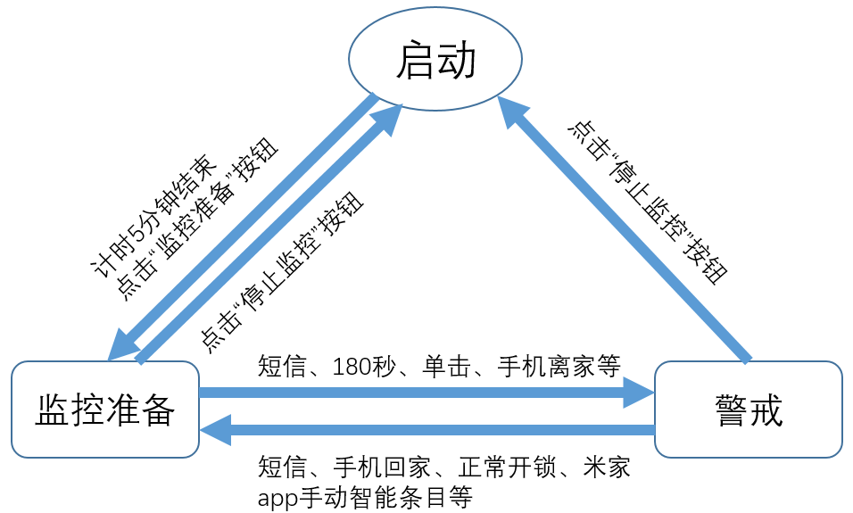

# SMA Elfin，短信报警精灵——介绍

## 是什么？

电脑版米家、智能家庭副中心/副班长（对应的说，米家网关就是班长、中心）、安防强化中枢、智能化增强，是米家网关+米家App的补充。

SMA Elfin，Short Message Alert Elfin，一个敏感、警觉、聪明、可靠的小精灵。

技术上，这个软件的核心是利用米家网关的“局域网通信协议”这个接口，以及更加可靠的移动通信网络来提供更为可靠的安防能力。即使是米家的服务器瘫痪、互联网被切断、市电被断开，仍然可以及时向主人发出必要的通知。

未来可能变成使用更方便的独立硬件，我已经在OpenWRT上试验过最核心的一些功能，很好用（对了，就是一个很小的路由器，MIPS 360MHz的处理器32M内存）。

## 不是什么？

不是米家app的替代品、不是官方出品（至少暂时不是）、不是米家网关的替代品。事实上，这个软件的使用离不开米家App（各种设置），更离不开米家网关。

## 到底能干什么？

1. 安防强化

   更可靠的短信报警、更多的报警类型，如：断电报警、断网报警、路由器故障报警、网关失联报警、传感器离线报警、视频监控（磁盘文件监控）报警、极端温度报警、WiFi遭入侵报警

2. 智能化增强

   离家/归家自动化、远程短信控制布防撤防、警戒状态与米家网关同步（自动的，也就是说米家app没有解决的问题——离家回家自动化——这个软件解决了）

3. 米家app功能移植及增补

   传感器状态显示、传感器电池电量显示、传感器通信状态显示、环境照度显示、zigbee智能插座控制、

4. 其他功能

   WiFi设备连接状态显示、缩小至系统图标栏、短信接收存储（支持中英文及中文超长短信）、多网卡环境识别、网关消息解码（供学习aqara局域网协议参考）、软件本身运行状态监控

## 未来有可能干什么？

1. 变身为独立硬件。可以在OpenWRT、Linux（如树莓派）、NAS（群晖）等平台上运行，最理想的是单独开发一个嵌入式系统，包含3G/4G modem、>32M内存、蓝牙4.x/5.x、自带锂电池、zigbee等。如果能被绿米官方接受，可以与现有系统更紧密的结合。

   期待有爱心的风投、有能力的开发者合作。

2. 利用miio接口实现和网关之间的警戒状态同步（缺少官方说明，miio协议不公开，目前看必要性不大）。

3. 在互联网中断（比如入户光纤被剪、入户电闸被拉断）时紧急提供热点信号，与正常路由器相同的SSID和加密方式，以便网关可以自动连接并继续发挥正常功能。

4. 支持HomeKit。理论上完全可行，也有成熟的参考（homeassistant、新版网关），只差开发的精力和能力。

5. 基于蓝牙的presence检测（参考monitor）。

6. 增加对其他品牌产品、其他技术的支持，如mqtt、openwrt、wifi器件（小米空净）等。

## 不能干什么？

上面没说的、说过但没具体说的也有可能只是部分支持、不支持纯英文超长短信（估计没人会用到）、不想实现的或没能力实现的各种功能和想法......

很多zigbee的器件我没有购买，所以暂时先不考虑。

WiFi入侵检测、回家离家检测等相关功能来自苹果路由器的支持，其他路由器暂未考虑（理论上只要路由器可以提供设备连接事件、WAN口连接事件对应的消息即可，当然，需要增加代码）。

由于需要占用特定套接字，所以重复执行本程序会报错。暂时不考虑增加重复执行检测（是的，就是还不会的意思）。

## 使用方法

0. 准备条件：网关开启局域网通信协议、各种基础知识、在手机米家app中预先定义好基于无线开关的单击离家双击回家自动智能（原名自动化）条目（重要！）、以及离家和回家（开zigbee插座）的手动智能条目。这些条目中，除了开关警戒模式外，最关键的就是控制zigbee插座！至于其它动作可以随意。

   苹果路由器开启syslog功能，并将目标IP设置为本软件运行的主机IP（建议设置为固定IP，因为苹果路由器每次改动都要重启）。

1. 运行环境：Win7/Win10 x64，安装.net framework 4.5或以上版本，不要与虚拟机软件共存（影响网络状态判断，可以运行于虚拟机但网卡必须是桥接模式）。

   必须有上网卡（带SIM卡的那种，3G、4G都行，2G也行）。

   强烈建议使用网线连接路由器（比无线更稳定、故障判断更明确更灵敏）。

   强烈建议使用笔记本电脑运行本程序，这样即使断电了你可以收到告警。当然，电池要能坚持起码几分钟才行。

2. 初次运行后，建议保存配置文件后关闭程序，然后手工编辑配置文件（推荐notepad++），比如各个传感器的名称、各个WiFi连网设备名称以及显示顺序等等。

3. 平常使用大部分功能都是自动完成的，一般不需要人为干预。

4. 上面没说清楚的，仔细看软件中的提示和说明、以及使用手册，最重要的是要会思考（智能家庭真的不适合低智商玩家）。可以提问但不保证会及时看及时回答。

5. 在手机上为该精灵使用的电话号码设置单独的短信铃音，警示性更好（更响亮）。

6. 软件有3种状态，分别是：待机、监控准备、警戒。理解了这些状态的含义以及状态间转换的条件，也就彻底理解该软件的功能和使用方法了。当然，也就理解开发者的良苦用心了。

   A. 启动/待机。软件加载后首先进入启动状态，会开始检查最重要的运行环境要求，然后启动UDP组播接收进程监听米家网关发出的组播消息。收到网关组播的心跳消息后会主动向网关发出get_id_list指令，获取子设备清单。仅在该状态下可以对所有参数进行更改、保存等操作。

   B. 监控准备。启动后待机5分钟或者点击“监控准备”按钮后即进入监控准备状态。如果在“报警参数设置”中启用了“苹果Airport路由器Syslog接口”，此时会启动另一个UDP接收线程，接收苹果路由器发过来的消息。

   C. 警戒状态。根据所选的监控项目，在警情发生（比如大门被打开）时会向指定号码发送告警短信。当然，由于警戒状态是与米家网关同步的，本地告警一样有。在监控准备状态下，短信指令、出门前单击无线开关、指定手机与路由器断开、180秒计时到时等事件会触发自动转换为警戒状态，即自动布防。在警戒状态下，短信指令、指定手机与路由器恢复连接、手机上执行预先设置好的智能条目、智能门锁正常开锁等事件会触发自动转换为监控准备状态（此时会利用zigbee插座开启事件），即自动撤防。

   D. 在警戒状态或监控准备状态下，点击“停止监控”按钮即返回到启动/待机状态，此时苹果路由器syslog消息接收线程会中止。

   

7. 短信指令，只限“设置目标号码”那儿声明的号码有权发布指令。内容包括：布防：短信+、短信布防；撤防：短信-、短信撤防；人体+、人体布防；人体-、人体撤防；目录+/-、目录布防/撤防；温度+/-、温度布防/撤防；文本-、文本清除（就是清空“运行信息”中的文本框）。

8. 与米家网关的警戒状态同步（布防与撤防）是通过无线开关的单击与双击事件（或模拟出的消息）、以及zigbee插座开启事件实现的。所以单击离家、双击回家、智能锁正常开锁（开启zigbee插座）、手动回家（开启zigbee插座）的智能（自动化）条目非常重要。

9. 本程序自身的运行状态监控（记录精灵（本程序）心跳）是指将运行状态保存在同目录下的“GWInfo.txt”文件中，每10分钟刷新一次。通过硬链接将该文件与网盘同步，即可实现远程监控。是的，我懒，先不考虑别的方法了。

10. 有时候程序关闭后退出不干净，再启动会提示套接字已被占用。这时启动任务管理器，找到名为“SMA Elfin.exe”的进程杀掉即可。至于为什么会这样，我也搞不清楚。

#### 动手能力更强、更喜欢折腾的，可以玩HomeAssistant，更强大、可玩性更高。当然，更复杂，而且是非常复杂，并且有些功能反而不够方便。

### 绿米的程序猿可恶！一个非常重要的功能没有实现：局域网通信接口对警戒状态的支持！包括状态改变报告、状态读取和设置指令。如果有这个功能的话一切就都简单多啦！

